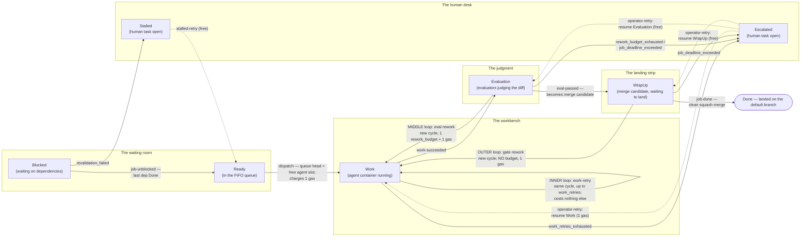

# Chuggernaut, as the model understands it

Chuggernaut is an orchestrator that turns a DAG of AI-agent jobs into merged
commits on a repository's default branch. This document explains **the
system** — what a job is, the journey it takes, the forces that act on it,
what each kind of failure costs, and how a job's story ends — using the
formal model in [`specs/chuggernaut/`](../specs/chuggernaut/) as the lens:
every behavioral claim below is grounded in a named decider, guard, or
invariant in the `.qnt` files, so nothing here is prose recollection. For
*how confident* to be in each claim — what is proved, to what bound — see
[model-status.md](model-status.md); for how the model's modules wire
together at code grain, see [model-map.md](model-map.md).

A vocabulary note: chuggernaut's spec knobs `work_retries`, `rework_budget`,
and `job_deadline` appear in the model as the constants `WORK_RETRIES`,
`REWORK_BUDGET`, and `DEADLINE`. The model makes the wall-clock deadline
countable as **deadline gas**: `DEADLINE` units per job, one charged on
every entry to Work (`machine.qnt`, DEADLINE const doc). This document uses
the spec names.

## 1. The story in one paragraph

A **job** is a unit of agent work bound for the default branch: a node in a
dependency DAG whose sole writer is the dispatcher. Its life is simple to
say: wait until every upstream dependency has landed, get handed to an AI
agent in a container, have the result judged by a fleet of evaluators, and
have the surviving diff squash-merged onto the default branch. At every one
of those stages the world pushes back — the agent crashes, the judges
reject the work, the default branch moved and the merge no longer applies —
and chuggernaut answers each kind of pushback differently: an in-place
relaunch for a crashed agent, a budgeted rework cycle for rejected work, an
*unbudgeted* rework cycle for a failed landing, a hard deadline that meters
everything re-entering Work, and, when all of that runs out, a human. A
job's story ends landed (`Done`), parked on a human's desk (`Escalated` or
`Stalled`) — or, in one deliberate corner of the design, it does not end at
all.

## 2. A job's journey

One picture, six regions. Solid arrows are the machine's own moves; dashed
arrows are the operator's hand. The three loops that return to Work are the
heart of the design — same destination, three very different price tags.

**The waiting room.** A job with unfinished dependencies sits Blocked, and
becomes Ready only when its *last* dependency reaches Done and its static
config still revalidates (`depRecheck` guard `depsDone`; `decideDepRecheck`).
Unblocking is not a cascade inside one event — each dependent is unblocked
by its own mailbox message (`decideDepRecheck`, Done-cascade note). Ready
jobs wait in a FIFO queue: dispatch always takes the head
(`decideDispatch`, `readyQ.head()`), and only when an agent slot is free —
at most `N_AGENTS` jobs may be in flight across Work, Evaluation, and
WrapUp (`dispatch` guard `activeCount < N_AGENTS`; Escalated and Stalled
hold no slot, per `isActive`). If revalidation fails at unblock time
instead — the file the job referenced was deleted or renamed since release
— the job goes straight to the human desk, pre-work (`decideRevalFail`).

**The workbench.** Dispatch launches the agent container and opens a
*cycle*: the attempt counter resets to 1 and one unit of deadline gas is
charged — every entry to Work costs gas (`decideDispatch`). If the agent
crashes or exits badly, chuggernaut relaunches it inside the same cycle, up
to `work_retries` times, at no cost beyond the attempt counter
(`decideTaskDone`, WFailure arm — the **inner loop**). Success fans the
diff out to the evaluators (`decideTaskDone`, WSuccess arm:
`FanOutEvaluators`).

**The judgment.** The evaluators judge the cycle's product. A pass makes
the job a merge candidate (`decideEval`, EPass arm:
`EnqueueMergeCandidate`). A product failure sends it back to the workbench
for a *new* cycle — the **middle loop** — consuming one unit of
`rework_budget` and one gas (`decideEval`, EProductFail arm).

**The landing strip.** WrapUp is the job waiting to land: the squash-merge
onto the default branch plus its gate checks. A clean landing ends the
story (`decideLand`, LClean arm: `SquashMerge`, `DeleteBranch`). A merge
conflict or gate CI failure sends the job back for a new cycle — the
**outer loop** — consuming **no budget at all**, only gas (`decideLand`,
LConflictOrGateFail arm). A landing can only fail while the default branch
is moving: in the model, the failure outcome exists only while the
environment is active (`land` action, envActive-gated outcome set).

**The human desk.** A job is Escalated or Stalled exactly when it holds an
open human task — an iff, proved as an invariant (`escalatedHasHumanTask`).
The operator's Retry resumes an escalated job at the phase that failed
(`decideOpRetry`); resuming Work charges one gas, resuming Evaluation or
WrapUp charges nothing — a small asymmetry with large consequences (§4,
§5). A stalled job retries back into the ready queue for free — it never
started, so nothing was spent (`decideStalledRetry`).

The three loops, side by side:

| Loop | Edge | A new cycle? | Spends | Bounded by |
|------|------|--------------|--------|------------|
| **Inner** — work retry | Work → Work (`work-retry`) | no — same cycle | one attempt, nothing else | `attempt ≤ work_retries` (`decideTaskDone` guard) |
| **Middle** — eval rework | Evaluation → Work (`job-rework-started eval_failure`) | yes | 1 `rework_budget` + 1 gas | `evalReworks < rework_budget` and gas (`decideEval` guard) |
| **Outer** — gate rework | WrapUp → Work (`job-rework-started merge_gate_failure`) | yes | **no budget** — 1 gas only | deadline gas alone (`gateReworksBoundedByGas`) |

## 3. The economy of failure

The design's core idea, as the model exposes it: **not all failures are
priced equally.** Each kind of pushback has its own currency, and each
currency runs out somewhere specific.

| The world's move | Chuggernaut's answer | The price | Where the money runs out |
|------------------|----------------------|-----------|--------------------------|
| Agent crashes or exits badly | Relaunch in the same cycle (`decideTaskDone`, WFailure arm) | One attempt; no budget, no gas | After `work_retries` relaunches: Escalated, `work_retries_exhausted` |
| Agent succeeds, evaluators reject the work | A fresh cycle from Work (`decideEval`, EProductFail arm) | 1 `rework_budget` + 1 gas | Budget spent: `rework_budget_exhausted`; else gas at 0: `job_deadline_exceeded` — budget is checked first (`decideEval`, label choice) |
| Merge conflict / gate CI failure | A fresh cycle from Work (`decideLand`, LConflictOrGateFail arm) | 1 gas — **no budget** | Gas at 0: Escalated, `job_deadline_exceeded` |
| Deadline exhaustion (gas at 0 when a rework is needed) | Refuse the re-entry to Work; escalate at the phase that needed it | — (this *is* the money running out) | `job_deadline_exceeded` from Evaluation or WrapUp; a Work-phase escalation with 0 gas cannot even be operator-resumed (`retryableEscalated`) |
| Dependency revalidation failure at unblock time | Park the job pre-work with a human task (`decideRevalFail`) | Nothing — no budget, no gas | Immediately: Stalled, `revalidation_failed` |

The asymmetry to notice: **product failures are budgeted; integration
failures are not.** A crashed container and a rejected diff are the job's
own product, so they draw on the job's own accounts (`work_retries`,
`rework_budget`). A merge conflict is the world's fault — "an integration
failure is not the author's product failure" (`decideLand` doc comment) —
so it draws on no budget at all, and only the deadline meters it. That one
pricing decision shapes the whole system: it is why a job that cannot
integrate can loop forever when no deadline is set
([model-status §5a](model-status.md#5a-the-documented-gate-loop-livelock-reproduced)),
and why anything that dodges gas — operator retries into Evaluation or
WrapUp — dodges the termination guarantee entirely
([model-status §5b](model-status.md#5b-discovered-the-deadline-backstop-does-not-bound-whole-system-termination)).

## 4. The forces on a job

Chuggernaut's dispatcher is a **single-writer actor**: "every fleet
mutation happens on the actor thread — no shared registry, no locks over
the decision" (chuggernaut spec §3.1, quoted in
[model-status §2](model-status.md#2-chuggernaut-as-the-model-sees-it)). So
the outside world never writes state — it only delivers events, one at a
time, and the only real concurrency is the order they arrive in. Five
forces push on a job through that mailbox:

| Force | What it does to a job | Where the model pins it |
|-------|----------------------|--------------------------|
| **The agent fleet** | Bounded capacity: at most `N_AGENTS` jobs in flight; Ready jobs queue FIFO behind that gate | `dispatch` guard `activeCount < N_AGENTS`; `isActive` |
| **The evaluators** | A verdict on every cycle's product: pass, or product failure | `evalReduce`, nondet `EPass`/`EProductFail` |
| **The moving default branch** | The **only** reason a landing can fail; a quiet branch always lands cleanly | `land`: `LConflictOrGateFail` exists only while `envActive` |
| **The operator** | Resolves escalations and stalls with Retry — and operator persistence defeats the deadline, because retries into Evaluation/WrapUp charge no gas | `opRetry`, `stalledRetry`; [model-status §5b](model-status.md#5b-discovered-the-deadline-backstop-does-not-bound-whole-system-termination) |
| **Time** | `job_deadline` as gas: `DEADLINE` units per job, one charged on every entry to Work — dispatch, both reworks, operator resume of Work; never same-cycle retries | `deadlineLeft`; invariant `deadlineNonNegative` |

## 5. How a job's story ends

**Done.** The good ending: a clean landing out of WrapUp — squash-merged,
branch deleted (`decideLand`, LClean arm). Done is absorbing: nothing
transitions out of it, and it never re-enters scheduling
(`terminalIsAbsorbing`; the table's terminal rows). Reaching Done is also
what a job's dependents are waiting for — it is the event that unblocks
the waiting room. One honest footnote: chuggernaut's transition table
permits landing straight out of Evaluation (a job with no wrap-up work),
but no v1 decider emits that edge — in the model, every Done passes through
the landing strip ([model-map §3](model-map.md#3-edge-provenance), row 20).

**Escalated.** The job hit a wall mid-flight and a human now owns it. Three
reasons, each naming the wall: `work_retries_exhausted` (the agent kept
failing inside one cycle — `decideTaskDone`), `rework_budget_exhausted`
(the evaluators kept rejecting — `decideEval`), and `job_deadline_exceeded`
(the gas ran out at Evaluation or WrapUp — `decideEval`/`decideLand`).
Escalated is a *settled* state: the container is gone, no agent slot is
held, and nothing further happens until the operator presses Retry, which
resumes the job at the phase that failed (`decideOpRetry`). One corner is
permanent: a Work-phase escalation with zero gas left can never resume,
because re-entering Work must charge gas (`retryableEscalated`). And one
hazard hides nearby: a job Blocked behind an escalated dependency has **no
human task of its own** — it is invisible in any "what needs a human?" view
([model-status §5c](model-status.md#5c-wedge-states)).

**Stalled.** The pre-work ending: the job never started. Its last
dependency landed, but revalidation of the job's static config failed —
the world changed under it before it ever ran (`decideRevalFail`,
`revalidation_failed`). A human task opens; the operator's Retry either
re-enqueues the job for free — nothing was ever spent
(`decideStalledRetry`) — or fails again and leaves the task open
(`decideStalledRetryFail`).

**The ending that isn't one.** If the default branch keeps moving against a
job, the outer loop spins: Work → Evaluation → WrapUp → gate failure →
Work, forever — each lap consuming no budget, only gas (`decideLand`,
LConflictOrGateFail arm). With a deadline set, gas meters the loop and the
job eventually escalates (`gateReworksBoundedByGas`: `gateReworks ≤
DEADLINE`, Apalache-verified). With no deadline set, **nothing** bounds it
— the machine-checked livelock of
[model-status §5a](model-status.md#5a-the-documented-gate-loop-livelock-reproduced),
narrated as a real trace in §6.2 below. The operator can build the same
non-ending by hand: escalate → Retry into Evaluation/WrapUp (free) → fail →
escalate again consumes nothing any budget meters
([model-status §5b](model-status.md#5b-discovered-the-deadline-backstop-does-not-bound-whole-system-termination)).

## 6. Two real days in the life

Both files under [docs/examples/](examples/) are **real model executions**,
not illustrative sketches: pinned-seed simulator runs projected into
chuggernaut's golden-trace schema and drift-guarded in CI (`check.sh`
Stage 8; [trace-conformance.md §3](trace-conformance.md)). The narrations
below match them step for step.

### 6.1 A clean day: three jobs land

[candidate_clean_lifecycle.yaml](examples/candidate_clean_lifecycle.yaml) —
job 1 Ready, job 2 Blocked on job 1, job 3 Ready; ready queue `[1, 3]`;
2 agent slots; `work_retries=1`, `rework_budget=1`, deadline gas 3.

| # | Event | What happened | In system terms |
|---|-------|---------------|-----------------|
| 1 | `dispatch` — job 1, Ready → Work | Queue head launches; slot 1 of 2 taken | `decideDispatch`: attempt := 1, gas 3 → 2 |
| 2 | `dispatch` — job 3, Ready → Work | Next in the queue takes the last slot; the fleet is saturated | `dispatch` guard `activeCount < N_AGENTS` now binds |
| 3 | `work-succeeded` — job 3, Work → Evaluation | Job 3's agent finishes first — arrival order is the only concurrency | `decideTaskDone`, WSuccess: `FanOutEvaluators` |
| 4 | `eval-passed` — job 3, Evaluation → WrapUp | The judges approve; job 3 becomes a merge candidate | `decideEval`, EPass: `EnqueueMergeCandidate` |
| 5 | `work-succeeded` — job 1, Work → Evaluation | Job 1's agent finishes | `decideTaskDone`, WSuccess |
| 6 | `eval-passed` — job 1, Evaluation → WrapUp | Job 1 approved too; both candidates wait to land | `decideEval`, EPass |
| 7 | `job-done` — job 3, WrapUp → Done | Job 3 lands cleanly | `decideLand`, LClean: `SquashMerge`, `DeleteBranch job/3` |
| 8 | `job-done` — job 1, WrapUp → Done | Job 1 lands — job 2's last dependency is now Done | `decideLand`, LClean: `SquashMerge`, `DeleteBranch job/1` |
| 9 | `job-unblocked` — job 2, Blocked → Ready | The waiting room releases job 2: dep Done, revalidation passed | `decideDepRecheck`, its own mailbox message; appended to the queue |
| 10 | `dispatch` — job 2, Ready → Work | Job 2 launches into the now-empty fleet | `decideDispatch`: gas 3 → 2 |
| 11 | `work-succeeded` — job 2, Work → Evaluation | The agent delivers | `decideTaskDone`, WSuccess |
| 12 | `eval-passed` — job 2, Evaluation → WrapUp | Approved | `decideEval`, EPass |
| 13 | `job-done` — job 2, WrapUp → Done | Everything has landed | `decideLand`, LClean: `SquashMerge`, `DeleteBranch job/2` |

Two things this day shows. Job 3 overtakes job 1 (steps 3–4) even though
job 1 dispatched first — inside the single-writer actor, event-arrival
order *is* the concurrency. And job 2's unblock (step 9) is its own step,
after its dependency's landing (step 8): the Done-cascade is one mailbox
message per dependent, not one atomic sweep (`decideDepRecheck`, Done-cascade
note).

### 6.2 A bad day at the gate

[candidate_gate_rework_loop.yaml](examples/candidate_gate_rework_loop.yaml) —
jobs 1 and 2 both Ready, queue `[1, 2]`; **1 agent slot**; `work_retries=1`,
`rework_budget=1`; gas 1000, modeling a graph with **no `job_deadline`
set**. This is the pinned Stage 6a trace — the machine-checked
counterexample behind [model-status §5a](model-status.md#5a-the-documented-gate-loop-livelock-reproduced).

| # | Event | What happened | In system terms |
|---|-------|---------------|-----------------|
| 1 | `dispatch` — job 1, Ready → Work | Job 1 takes the only slot; job 2 waits | `decideDispatch`: gas 1000 → 999 |
| 2 | `work-succeeded` — job 1, Work → Evaluation | The agent delivers | `decideTaskDone`, WSuccess |
| 3 | `job-rework-started eval_failure` — job 1, Evaluation → Work | The judges reject: a *product* failure, so the budget pays | `decideEval`, EProductFail: `evalReworks` 0 → 1 — the whole `rework_budget` spent; gas → 998 |
| 4 | `work-succeeded` — job 1, Work → Evaluation | The reworked diff comes back | `decideTaskDone`, WSuccess |
| 5 | `eval-passed` — job 1, Evaluation → WrapUp | This time the judges approve | `decideEval`, EPass |
| 6 | `job-rework-started merge_gate_failure` — job 1, WrapUp → Work | The branch moved; the landing fails. Gate rework #1 — **no budget touched** | `decideLand`, LConflictOrGateFail: `gateReworks` → 1, gas → 997, `evalReworks` still 1 |
| 7 | `work-succeeded` — job 1, Work → Evaluation | Rebased and rebuilt | `decideTaskDone`, WSuccess |
| 8 | `eval-passed` — job 1, Evaluation → WrapUp | Approved again | `decideEval`, EPass |
| 9 | `job-rework-started merge_gate_failure` — job 1, WrapUp → Work | The branch moved *again*. Gate rework #2 | `gateReworks` → 2, gas → 996 |
| 10 | `work-succeeded` — job 1, Work → Evaluation | Once more around | `decideTaskDone`, WSuccess |
| 11 | `eval-passed` — job 1, Evaluation → WrapUp | Approved — the product was never the problem | `decideEval`, EPass |
| 12 | `job-rework-started merge_gate_failure` — job 1, WrapUp → Work | Gate rework #3 | `gateReworks` → 3, gas → 995 |

After step 12, job 1 has taken **three** gate reworks — more than
`work_retries + rework_budget = 2` combined — while `evalReworks` has sat
at 1 since step 3: the budget ledger never moves again, and only gas drains
(1000 → 995, one unit per entry to Work). With no deadline, this loop is
metered by nothing and the day never ends. Collateral damage: job 2 never
runs — the loop holds the fleet's only slot, so the queue behind a spinning
job starves.

## 7. What the model doesn't cover

This explanation is exactly as wide as the v1 model. The staged-evaluation
internals are one collapsed verdict (`EvalOutcome`), the merge queue and
gate mechanics one collapsed landing (`LandOutcome`), and there are no task
records, no capacity/launch queue (`N_AGENTS` is a bare slot count), no
crash/restart reconciliation, and no authoring lifecycle — Draft, Frozen,
Batched, and Revoked are table-only states no v1 decider can reach. Per-row
detail, and which roadmap version restores each answer, in
[model-status §6b](model-status.md#6b-abstracted-away-in-v1). Where those
mechanisms matter — stage short-circuiting, landing order, queue-wait
escalations, revoke cascades — this document is silent, deliberately.
