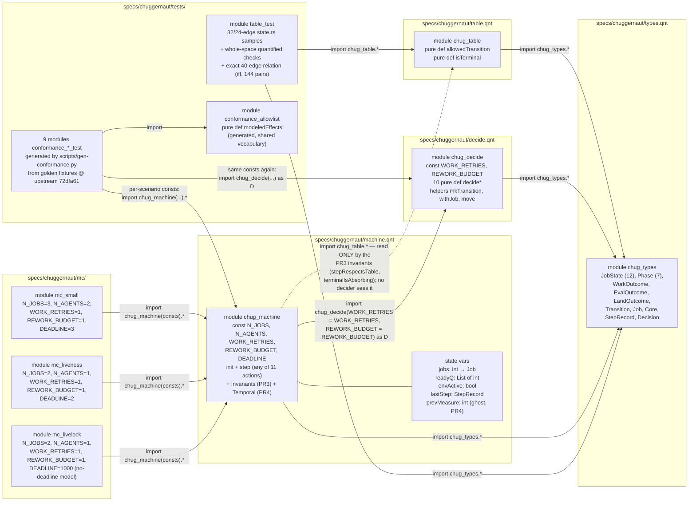
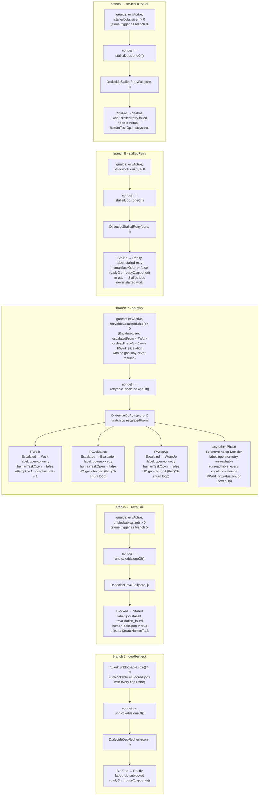
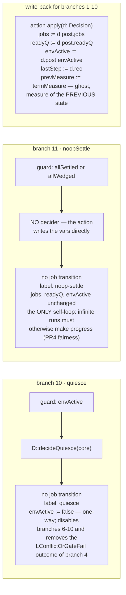
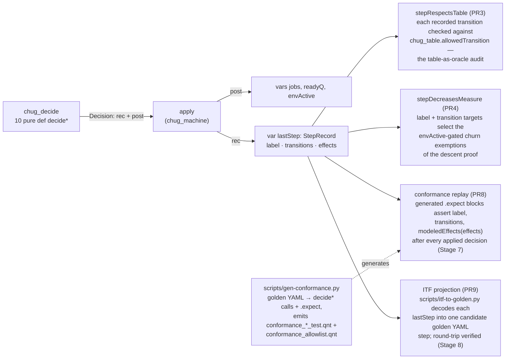

# Model map: code-level integration of the .qnt modules

As of **2026-08-12, main @ `3365084`**.

This is the code-level companion to
[model-status.md](model-status.md): where that document draws the
abstraction boundary, the lifecycle, and the epistemic status of each claim,
this one wires the actual code together — every module and instantiation,
every branch of `chug_machine::step` with its guard, nondet draw, decider,
and field writes, and every legal edge of the transition table traced to the
exact decider arm (or non-decider) that emits it. The conformance harness
around `lastStep` is designed in
[trace-conformance.md](trace-conformance.md).

Derived counts used throughout (all re-derivable from the sources):

- `step` is `any` of **11 actions** (`machine.qnt`).
- `decide.qnt` has **10 `pure def decide*` deciders** (plus the helpers
  `mkTransition`, `withJob`, `move`).
- `allowedTransition` (`table.qnt`) admits **40 legal edges** out of the
  12 × 12 = 144 ordered state pairs; **17** are emitted by v1 deciders,
  **23** are table-only (unreachable in the v1 machine).

## 1. Module and instantiation map

Solid arrows are imports (arrow points at the imported module); labels on
instantiation edges carry the concrete `const` values. The one dashed edge
is the deliberate design fact of the whole model: `chug_table` is imported
by `chug_machine` **only** for the PR3 invariant oracle — no decider can see
it, so `stepRespectsTable` audits the deciders against an independent
transcription of `state.rs:22-45`.

Reading notes:

- **Const flow.** `chug_machine` declares five consts and forwards two of
  them into its own `chug_decide` instance
  (`import chug_decide(WORK_RETRIES = WORK_RETRIES, REWORK_BUDGET =
  REWORK_BUDGET) as D`). The three `mc/` modules pin all five per instance
  (values on the edges above). Each generated conformance test pins them
  per scenario (e.g. `conformance_eval_failure_rework_test`: `N_JOBS=1,
  N_AGENTS=1, WORK_RETRIES=0, REWORK_BUDGET=1, DEADLINE=10`) and — because
  a `chug_machine` instance does not re-export its nested `D` — imports
  `chug_decide` a second time with the same consts to drive decisions
  directly through `apply(D::decide...)`.
- **`chug_types` everywhere.** The `mc/` and conformance modules also
  import `chug_types.*` directly (instances don't re-export imports; the
  constructors must be in scope for CLI invariants and test literals).
  Those edges are drawn only for the modules whose types import would
  otherwise be invisible.
- **`conformance_allowlist`** is generated from the same
  `scripts/conformance_vocab.py` tables the harness scripts use, so the
  model-side and golden-side halves of the effect vocabulary cannot drift
  (§4 below).

## 2. The step relation, completely

`step` is `any` of **11 actions** (`machine.qnt`). Every
guard lives in the machine action; every state change is computed by a pure
`chug_decide` function and written back through `apply`, which also records
the decision's `StepRecord` into `lastStep` (the shape mirrors chuggernaut's
gather-view → decide → apply-transitions → run-effects dispatcher shim).
The 11 branches are split across three diagrams; each branch appears exactly
once:

| Diagram | Branches | Actions |
|---------|----------|---------|
| [2a. Job execution](#2a-job-execution-branches-1-4) | 1–4 | `dispatch`, `taskDone`, `evalReduce`, `land` |
| [2b. Dependencies and operator](#2b-dependency-and-operator-branches-5-9) | 5–9 | `depRecheck`, `revalFail`, `opRetry`, `stalledRetry`, `stalledRetryFail` |
| [2c. Bookkeeping and write-back](#2c-bookkeeping-and-write-back-branches-10-11) | 10–11 | `quiesce`, `noopSettle` |

Conventions in the diagrams: the top node of each column is the machine
action's full guard; `nondet` nodes name the exact set drawn from and the
outcome type; leaf nodes give the transition, the `lastStep` label the
decider records, every Job/Core field the arm writes, and the effects list.
"Gas" is `deadlineLeft` (the `job_deadline` backstop); it is charged on
**every entry to Work** except same-cycle `work-retry`.

### 2a. Job execution (branches 1-4)

```mermaid
flowchart LR
  subgraph B1["branch 1 · dispatch"]
    direction TB
    G1["guards:<br/>readyQ.length() > 0<br/>activeCount < N_AGENTS<br/>jobs.get(readyQ.head()).deadlineLeft > 0"]
    C1["D::decideDispatch(core)<br/>j = readyQ.head() — no nondet"]
    O1["Ready → Work<br/>label: dispatch<br/>attempt := 1<br/>deadlineLeft -= 1<br/>readyQ := readyQ.tail()<br/>effects: CreateWorkTask, LaunchContainer"]
    G1 --> C1
    C1 --> O1
  end
  subgraph B2["branch 2 · taskDone"]
    direction TB
    G2["guard:<br/>workJobs.size() > 0<br/>(enabled even when quiesced —<br/>failure is the job's own product)"]
    N2["nondet j = workJobs.oneOf()<br/>nondet out = Set(WSuccess, WFailure).oneOf()"]
    C2["D::decideTaskDone(core, j, out)"]
    O2a["WSuccess<br/>Work → Evaluation<br/>label: work-succeeded<br/>effects: FanOutEvaluators"]
    O2b["WFailure · attempt ≤ WORK_RETRIES<br/>Work → Work<br/>label: work-retry<br/>attempt += 1<br/>same cycle: no gas"]
    O2c["WFailure · attempt > WORK_RETRIES<br/>Work → Escalated<br/>label: job-escalated work_retries_exhausted<br/>escalatedFrom := PWork<br/>humanTaskOpen := true<br/>wasEscalated := true<br/>effects: CreateEscalationTask"]
    G2 --> N2
    N2 --> C2
    C2 --> O2a
    C2 --> O2b
    C2 --> O2c
  end
  subgraph B3["branch 3 · evalReduce"]
    direction TB
    G3["guard:<br/>evalJobs.size() > 0"]
    N3["nondet j = evalJobs.oneOf()<br/>nondet out = Set(EPass, EProductFail).oneOf()"]
    C3["D::decideEval(core, j, out)"]
    O3a["EPass<br/>Evaluation → WrapUp<br/>label: eval-passed<br/>effects: EnqueueMergeCandidate"]
    O3b["EProductFail · evalReworks < REWORK_BUDGET<br/>and deadlineLeft > 0<br/>Evaluation → Work<br/>label: job-rework-started eval_failure<br/>evalReworks += 1<br/>attempt := 1 · deadlineLeft -= 1"]
    O3c["EProductFail · otherwise (budget checked first)<br/>Evaluation → Escalated<br/>label: job-escalated rework_budget_exhausted<br/>if evalReworks ≥ REWORK_BUDGET,<br/>else job-escalated job_deadline_exceeded<br/>escalatedFrom := PEvaluation<br/>humanTaskOpen := true · wasEscalated := true<br/>effects: CreateEscalationTask"]
    G3 --> N3
    N3 --> C3
    C3 --> O3a
    C3 --> O3b
    C3 --> O3c
  end
  subgraph B4["branch 4 · land"]
    direction TB
    G4["guard:<br/>wrapupJobs.size() > 0"]
    N4["nondet j = wrapupJobs.oneOf()<br/>nondet out drawn from<br/>Set(LClean, LConflictOrGateFail) if envActive,<br/>Set(LClean) if quiesced"]
    C4["D::decideLand(core, j, out)"]
    O4a["LClean<br/>WrapUp → Done<br/>label: job-done<br/>effects: SquashMerge, DeleteBranch"]
    O4b["LConflictOrGateFail · deadlineLeft > 0<br/>WrapUp → Work<br/>label: job-rework-started merge_gate_failure<br/>gateReworks += 1 — rework_budget NOT consumed<br/>attempt := 1 · deadlineLeft -= 1<br/>(the documented livelock edge, gas-metered only)"]
    O4c["LConflictOrGateFail · deadlineLeft = 0<br/>WrapUp → Escalated<br/>label: job-escalated job_deadline_exceeded<br/>escalatedFrom := PWrapUp<br/>humanTaskOpen := true · wasEscalated := true<br/>effects: CreateEscalationTask"]
    G4 --> N4
    N4 --> C4
    C4 --> O4a
    C4 --> O4b
    C4 --> O4c
  end
```

### 2b. Dependency and operator (branches 5-9)

Branches 5 and 6 share a trigger (a Blocked job whose deps are all Done);
which one fires is the environment's nondet choice. Branches 6–9 are all
gated on `envActive` — the operator and repo churn are environment, which
is exactly why `quiesce` (branch 10) restores termination
(model-status.md §5b).

### 2c. Bookkeeping and write-back (branches 10-11)

`noopSettle` is the one branch that bypasses `decide.qnt` entirely: it
writes the vars directly and is the model's only self-loop — the fairness
encoding the PR4 descent proof leans on. Everything else goes through
`apply`.

Branch-count check: 4 + 5 + 2 = **11** diagrammed branches =
the 11 entries of `step`'s `any` in `machine.qnt`. Decider-coverage check:
branches 1–10 apply, in order, `decideDispatch`, `decideTaskDone`,
`decideEval`, `decideLand`, `decideDepRecheck`, `decideRevalFail`,
`decideOpRetry`, `decideStalledRetry`, `decideStalledRetryFail`,
`decideQuiesce` — all **10** `pure def decide*` functions, each in exactly
one branch.

## 3. Edge provenance

The proof-of-integration table: one row per **legal** edge of
`allowedTransition` (`table.qnt`), in the table's own clause order (the
`(_, Revoked)` catch-all rows last). Pick any edge in model-status.md §3's
state diagram and this table names the code that produces it.

Counts: **40 legal edges** (of 144 ordered pairs); **17** emitted by
deciders; **23** table-only. "Golden marker" is the `PublishEvent job-*`
decision marker `scripts/gen-conformance.py` keys the replay direction on —
"—" means no golden fixture exercises the edge, so the replay map has no
entry for it.

| # | Edge | Producer (branch · decider arm) | `lastStep` label | Golden marker | Budget and gas | Guard summary |
|---|------|--------------------------------|------------------|---------------|----------------|---------------|
| 1 | Draft → Ready | — unreachable in v1 (arrives v4: authoring) | — | — | — | table-only; `init` starts post-release (Ready/Blocked) |
| 2 | Draft → Blocked | — unreachable in v1 (arrives v4) | — | — | — | table-only |
| 3 | Draft → Frozen | — unreachable in v1 (arrives v4) | — | — | — | table-only |
| 4 | Frozen → Draft | — unreachable in v1 (arrives v4) | — | — | — | table-only |
| 5 | Frozen → Ready | — unreachable in v1 (arrives v4) | — | — | — | table-only; replay tests absorb the golden release prefix Frozen → Ready into `replayInit` instead of emitting it |
| 6 | Frozen → Blocked | — unreachable in v1 (arrives v4) | — | — | — | table-only; absorbed into `replayInit` like row 5 |
| 7 | Frozen → Batched | — unreachable in v1 (arrives v4: batches) | — | — | — | table-only |
| 8 | Batched → Frozen | — unreachable in v1 (arrives v4) | — | — | — | table-only |
| 9 | Batched → Done | — unreachable in v1 (arrives v4) | — | — | — | table-only |
| 10 | Blocked → Ready | branch 5 · `decideDepRecheck` | `job-unblocked` | `job-unblocked` | none; `readyQ.append(j)` | every dep Done (`unblockable`) |
| 11 | Blocked → Stalled | branch 6 · `decideRevalFail` | `job-stalled revalidation_failed` | `job-stalled` | none; `humanTaskOpen := true` | every dep Done, `envActive` |
| 12 | Ready → Work | branch 1 · `decideDispatch` | `dispatch` | `job-started` | gas −1; `attempt := 1`; readyQ pops head | queue nonempty, `activeCount < N_AGENTS`, gas > 0 |
| 13 | Ready → Stalled | — no v1 decider emits it (v1's only stall source is revalidation out of Blocked); no v2–v4 milestone claims it | — | — | — | table-only |
| 14 | Work → Work | branch 2 · `decideTaskDone` WFailure, retry arm | `work-retry` | — | `attempt += 1`; **no gas** (same cycle) | `attempt ≤ WORK_RETRIES` |
| 15 | Work → Evaluation | branch 2 · `decideTaskDone` WSuccess | `work-succeeded` | `job-evaluation-started` | none | nondet WSuccess |
| 16 | Work → Escalated | branch 2 · `decideTaskDone` WFailure, exhausted arm | `job-escalated work_retries_exhausted` | — | none; `escalatedFrom := PWork`, `humanTaskOpen`, `wasEscalated` | `attempt > WORK_RETRIES` |
| 17 | Evaluation → Evaluation | — unreachable in v1 (arrives v2: staged-eval rounds below the one-nondet-`EvalOutcome` grain) | — | — | — | table-only |
| 18 | Evaluation → Work | branch 3 · `decideEval` EProductFail, rework arm | `job-rework-started eval_failure` | `job-rework-started` | `evalReworks += 1` (budgeted); gas −1; `attempt := 1` | `evalReworks < REWORK_BUDGET` and gas > 0 |
| 19 | Evaluation → WrapUp | branch 3 · `decideEval` EPass | `eval-passed` | `job-wrapup-started` | none | nondet EPass |
| 20 | Evaluation → Done | — no v1 decider emits it (v1 always routes Done through WrapUp); no v2–v4 milestone claims it | — | — | — | table-only |
| 21 | Evaluation → Escalated | branch 3 · `decideEval` EProductFail, escalate arm | `job-escalated rework_budget_exhausted`, or `job-escalated job_deadline_exceeded` (budget checked first) | `job-escalated` | none; `escalatedFrom := PEvaluation`, `humanTaskOpen`, `wasEscalated` | `evalReworks ≥ REWORK_BUDGET`, or gas = 0 |
| 22 | WrapUp → WrapUp | — unreachable in v1 (arrives v3: merge-queue machinery) | — | — | — | table-only |
| 23 | WrapUp → Work | branch 4 · `decideLand` LConflictOrGateFail, rework arm | `job-rework-started merge_gate_failure` | `job-rework-started` | `gateReworks += 1` — **rework_budget NOT consumed**; gas −1; `attempt := 1` | gas > 0; outcome drawable only while `envActive` — **the documented livelock edge** (model-status.md §5a) |
| 24 | WrapUp → Done | branch 4 · `decideLand` LClean | `job-done` | `job-done` | none; effects SquashMerge, DeleteBranch | nondet LClean |
| 25 | WrapUp → Escalated | branch 4 · `decideLand` LConflictOrGateFail, gas-exhausted arm | `job-escalated job_deadline_exceeded` | — | none; `escalatedFrom := PWrapUp`, `humanTaskOpen`, `wasEscalated` | gas = 0 |
| 26 | Escalated → Work | branch 7 · `decideOpRetry`, PWork arm | `operator-retry` | — | gas −1; `attempt := 1`; `humanTaskOpen := false` | `envActive`; gas > 0 (`retryableEscalated`) |
| 27 | Escalated → Evaluation | branch 7 · `decideOpRetry`, PEvaluation arm | `operator-retry` | — | **no gas** — the discovered operator-churn loop (model-status.md §5b); `humanTaskOpen := false` | `envActive` |
| 28 | Escalated → WrapUp | branch 7 · `decideOpRetry`, PWrapUp arm | `operator-retry` | — | **no gas** (same finding); `humanTaskOpen := false` | `envActive` |
| 29 | Stalled → Ready | branch 8 · `decideStalledRetry` | `stalled-retry` | — | none; `humanTaskOpen := false`; `readyQ.append(j)` | `envActive` |
| 30 | Stalled → Stalled | branch 9 · `decideStalledRetryFail` | `stalled-retry-failed` | — | none; no field writes | `envActive` |
| 31 | Draft → Revoked | — unreachable in v1 (arrives v4: revoke) | — | — | — | catch-all `(_, Revoked)` clause |
| 32 | Frozen → Revoked | — unreachable in v1 (arrives v4) | — | — | — | catch-all clause |
| 33 | Batched → Revoked | — unreachable in v1 (arrives v4) | — | — | — | catch-all clause |
| 34 | Blocked → Revoked | — unreachable in v1 (arrives v4) | — | — | — | catch-all clause |
| 35 | Ready → Revoked | — unreachable in v1 (arrives v4) | — | — | — | catch-all clause |
| 36 | Work → Revoked | — unreachable in v1 (arrives v4) | — | — | — | catch-all clause |
| 37 | Evaluation → Revoked | — unreachable in v1 (arrives v4) | — | — | — | catch-all clause |
| 38 | WrapUp → Revoked | — unreachable in v1 (arrives v4) | — | — | — | catch-all clause |
| 39 | Escalated → Revoked | — unreachable in v1 (arrives v4) | — | — | — | catch-all clause |
| 40 | Stalled → Revoked | — unreachable in v1 (arrives v4) | — | — | — | catch-all clause |

Decider-output completeness: rows 10–12, 14–16, 18–19, 21, 23–30 cover
every transition-emitting arm of all the deciders. Two decisions emit **no**
transition and therefore have no row: `decideQuiesce` (branch 10, label
`quiesce`, empty transitions, `envActive := false`) and `decideOpRetry`'s
defensive `operator-retry-unreachable` arm (a no-op `Decision` that keeps
the match total; `scripts/itf-to-golden.py` treats its appearance in a trace
as a model bug). `noopSettle` (branch 11) likewise records an empty
transition list without any decider.

### 3a. The v1 reachability gap (edges the table allows, no decider emits)

The 23 table-only rows above, grouped:

- **Authoring flow (9 edges, v4):** rows 1–9 — all Draft/Frozen/Batched
  rows. The v1 machine's `init` starts every job where release leaves it
  (Ready or Blocked), so the pre-release lifecycle exists only in the table.
- **The Revoked column (10 edges, v4):** rows 31–40 — the table's
  `(_, Revoked)` catch-all admits revocation from every non-terminal state,
  and no v1 decider emits `Revoked`. Consequence tracked in
  model-status.md §6b: every invariant is vacuous over Revoked today.
- **Ready → Stalled (row 13):** v1 stalls only out of Blocked
  (`decideRevalFail`); nothing in the v2–v4 roadmap names this edge.
- **Evaluation → Evaluation (row 17, v2)** and **WrapUp → WrapUp
  (row 22, v3):** the self-loops of the staged-eval and merge-queue
  machinery that v1 collapses into single nondet outcomes.
- **Evaluation → Done (row 20):** the table permits landing straight out of
  Evaluation, but every v1 path to Done goes through WrapUp
  (`decideLand(LClean)`); no roadmap milestone names this edge either.

### 3b. The converse direction (no decider escapes the table)

Every edge a decider emits is a table row — guaranteed mechanically, not by
this document: the invariant `stepRespectsTable` (`machine.qnt`, PR3) folds
over `lastStep.transitions` on every state and requires
`allowedTransition(t.from, t.to)` for each recorded transition, with the
table imported **only** there (deciders cannot consult it, so the check is
against an independent oracle). Status per model-status.md row 2: exhaustive
to depth 4 (Apalache, all nondet choices), randomized to depth 40 (2,000
traces). The 17 producer rows above are the visual restatement: every
emitted edge appears in the table's row set.

### 3c. Cross-check against `tests/table_test.qnt`

`table_test.legalEdges` is the port of the Rust `table_edges` sample — **32
edges, a strict subset of the 40**, matching `state.rs`'s own test rather
than enumerating the function. When this map was first drawn it surfaced
that 8 legal edges lay outside that sample (4 Revoked-column edges covered
only by the quantified revoke check; Work → Work, Work → Escalated,
Evaluation → Escalated covered only indirectly by `stepRespectsTable`; and
Evaluation → Evaluation asserted by nothing at all). That gap is now
closed: `table_test.fullLegalSetIsExactTest` pins the **entire 40-edge
relation** with an iff over all 144 ordered pairs, so any drift in the
table — an edge added *or* removed — fails the suite, not just the sampled
edges.

`table_test.illegalEdges` (24 edges) plus the three quantified
whole-space checks (`terminalStatesAbsorbingTest`,
`everyNonTerminalMayRevokeTest`, `allowedImpliesNonTerminalSourceTest`)
cover the negative side; the 104 illegal pairs are also implied
exhaustively by the iff above.

## 4. Data shapes

### The `Job` record (`types.qnt`)

Writer lists below are exhaustive over `decide.qnt` (verified by grep per
field); `init` (`machine.qnt`) additionally initializes every field.

| Field | Written by | Read by (guards + deciders) | Invariants constraining it |
|-------|------------|------------------------------|----------------------------|
| `state` | every transition-emitting arm, exclusively through the single funnel `move` (the model's `Core::set_state`); `decideQuiesce` writes none | the machine's phase sets (`workJobs`, `evalJobs`, `wrapupJobs`, `stalledJobs`, `unblockable`, `retryableEscalated`), `activeCount`, `depsDone`, `allSettled`/`allWedged`, `phaseRank` | `stepRespectsTable`, `readyQueueOnlyReady`, `activeIsExecuting`, `terminalIsAbsorbing`, `escalatedHasHumanTask` |
| `deps` | `init` only — never rewritten | `depsDone` (branch 5/6 trigger), `allWedged` | `depsAcyclicAndSmaller` (every dep known and strictly smaller — DAG at every reachable state); probed by `witnessBlockedUnblocks` |
| `escalatedFrom` | escalate arms: `decideTaskDone` (:= PWork), `decideEval` (:= PEvaluation), `decideLand` (:= PWrapUp); never reset — operator retry keeps the stamp | `decideOpRetry`'s match; `retryableEscalated` guard | none directly; drives which op-retry arm fires and whether a gasless PWork escalation is permanently settled |
| `attempt` | `decideDispatch` := 1; `decideTaskDone` += 1 (retry); `decideEval` := 1 (rework); `decideLand` := 1 (rework); `decideOpRetry` := 1 (PWork arm) | `decideTaskDone`'s retry-vs-escalate guard | `attemptWithinRetries` (≤ WORK_RETRIES + 1), `activeIsExecuting` (attempt > 0 iff ever entered Work); input to `phaseRank`/`termMeasure` |
| `evalReworks` | `decideEval` += 1 (rework arm only) | `decideEval`'s budget guard and escalation-label pick | `evalReworksWithinBudget` (≤ REWORK_BUDGET) |
| `gateReworks` | `decideLand` += 1 (rework arm only) | no guard or decider reads it — pure accounting | `gateReworksBoundedByGas` (≤ DEADLINE); the expected-fail probe `gateReworksWithinBudgets`; `witnessGateReworkTwice` |
| `deadlineLeft` | `init` := DEADLINE; −1 on every entry to Work: `decideDispatch`, `decideEval` (rework), `decideLand` (rework), `decideOpRetry` (PWork) | machine `dispatch` guard; `decideEval`/`decideLand` rework-vs-escalate guards; `retryableEscalated` | `deadlineNonNegative` (0 ≤ gas ≤ DEADLINE); the GAS term of `termMeasure` |
| `humanTaskOpen` | := true by the three escalate arms + `decideRevalFail`; := false by `decideOpRetry`, `decideStalledRetry`; untouched (stays true) by `decideStalledRetryFail` | no guard reads it | `escalatedHasHumanTask` (open **iff** Escalated or Stalled) |
| `wasEscalated` | GHOST (PR3): := true by the three escalate arms; never cleared | nothing | only `witnessEscalatedRecovered` (anti-vacuity: an escalated job still reached Done) |

### `Core` and the machine vars

| Field | Written by | Read by | Invariants |
|-------|------------|---------|------------|
| `jobs` | every decider (via `move`/`withJob`); mirrored to the var by `apply` | everything above | all ten |
| `readyQ` | `decideDispatch` (pop head), `decideDepRecheck` (append), `decideStalledRetry` (append) | `dispatch` guard + `decideDispatch` (`head`) | `readyQueueOnlyReady` (known, Ready, no duplicates), `terminalIsAbsorbing` (no terminal job queued) |
| `envActive` | `decideQuiesce` only (one-way, := false) | branch 4's outcome set; guards of branches 6–10; `allWedged`; `termMeasure` | none directly — it is the quiescence premise of the PR4 claims |

The machine's two extra vars are observations, not dispatcher state:
`lastStep: StepRecord` (below) and `prevMeasure: int` (PR4 ghost —
`termMeasure` of the previous state, written by every action, read only by
`stepDecreasesMeasure`).

### `StepRecord` / `Decision`, and where `lastStep` flows

`Decision = { rec: StepRecord, post: Core }` is what every decider returns —
the Quint analogue of chuggernaut's `decide(view, event) → (Vec<Transition>,
Vec<Effect>)`. `StepRecord = { label, transitions, effects }` deliberately
mirrors the golden-trace YAML step schema, which is what makes the
conformance harness possible: a simulator run already *is* a golden-shaped
trace. `lastStep` has **four** consumers — three readers of the live var
plus the ITF projection offline:

Both harness scripts share `scripts/conformance_vocab.py`, so the effect
vocabulary `U3` asserts through and the one `U4` emits are the same tables —
see [trace-conformance.md](trace-conformance.md) §4 for the vocabulary and
§2/§3 for the two directions.

## 5. Related documents

- [model-status.md](model-status.md) — the epistemics: what is proved, to
  what bound, what is unknown, and the findings (§5a livelock, §5b operator
  churn, §5c wedge) this map's edges point at.
- [trace-conformance.md](trace-conformance.md) — the conformance harness
  design both `lastStep` consumers on the right of the last diagram
  implement.
- [../README.md](../README.md) — toolchain, commands, roadmap (v2–v4
  milestones referenced by §3's unreachable rows).
