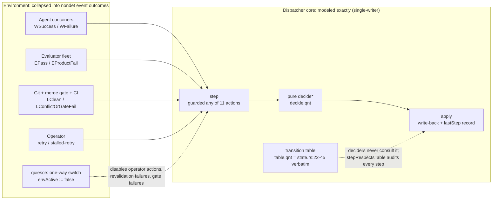
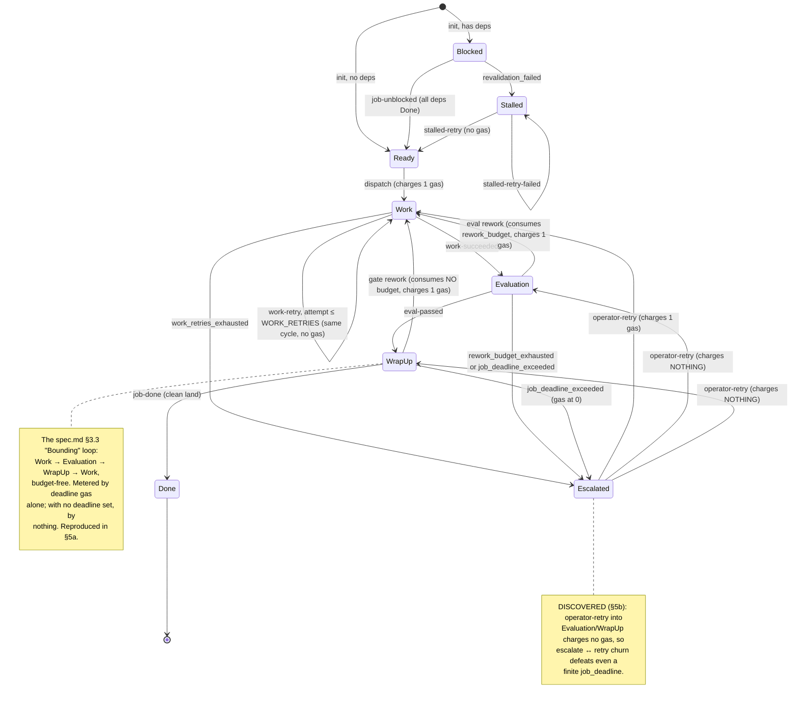
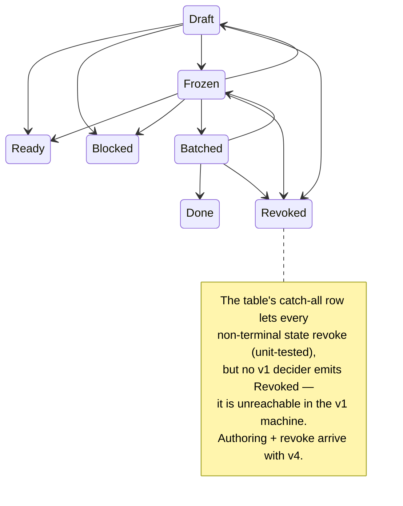

# Model status: determined, unknown, violated

Epistemic state of the swarm-spec Quint model of chuggernaut's orchestration
core — what is proved (and to what bound), what is reproduced or newly
discovered, and what the model cannot yet answer.

As of **2026-08-12, main @ `3365084`**. Every number below is re-derivable
with the commands in [§7](#7-re-deriving-everything); sources are
`specs/chuggernaut/machine.qnt` (Invariants/Temporal sections),
`scripts/check.sh` (stage comments carry the measured timings, bounds, and
seeds), and [docs/trace-conformance.md](trace-conformance.md).

## 1. At a glance

Status vocabulary: **PROVED** = machine-checked exhaustively (bound stated);
**REPRODUCED** = behavior documented upstream, now confirmed as a
machine-checked artifact; **DISCOVERED** = behavior not documented upstream,
found by the model; **TESTED** = randomized evidence only; **ESTABLISHED** =
conformance to recorded implementation behavior, mechanically re-checked at
the stated grain (used only for model↔code conformance claims — never
whole-code equivalence); **UNKNOWN** = not determinable with the current
model/tooling; **OUT OF SCOPE** = deferred to the v2–v4 roadmap.

| # | Claim | Status | Method | Where |
|---|-------|--------|--------|-------|
| 1 | The transition table matches chuggernaut `state.rs:22-45` (verbatim, clause-order-preserving) | PROVED (finite function) | `quint test` 7/7: the Rust `table_edges` enumeration (32 legal + 24 illegal edges, same order), whole-state-space quantified checks, and `fullLegalSetIsExactTest` — an iff over all 144 ordered pairs against the explicit 40-edge legal relation | `table.qnt`, `tests/table_test.qnt`; check Stage 2 |
| 2 | Every decider emits only table-legal transitions (`stepRespectsTable` — the table as independent oracle) | PROVED to depth 4; TESTED to depth 40 | Apalache exhaustive `--max-steps=4`; 2,000 random traces × depth 40 | `machine.qnt`; check Stages 4–5 |
| 3 | The other 9 safety invariants (budgets, gas ≥ 0, queue hygiene, escalation ⇔ human task, DAG shape) | PROVED to depth 4; TESTED to depth 40 | same as row 2 (`allInvariants`) | `machine.qnt`; check Stages 4–5 |
| 4 | Invariant checking is non-vacuous (all 4 witnesses hit) | TESTED | seeded 50,000-trace run, per-witness zero-hit gate | check Stage 4 |
| 5 | The documented budget-free gate-rework livelock (spec.md §3.3 "Bounding") is real | REPRODUCED | seeded expected-fail of `gateReworksWithinBudgets` on `mc_livelock`: 3 unbudgeted gate reworks of one job, 0.8 s | check Stage 6a; [§5a](#5a-the-documented-gate-loop-livelock-reproduced) |
| 6 | Deadline gas bounds the gate loop (`gateReworks ≤ DEADLINE`) | PROVED to depth 4; TESTED to depth 40 | `gateReworksBoundedByGas` (Stage 5); `gateReworksWithinBudgets` HOLDS on `mc_liveness` (DEADLINE=2, Stage 6c) | `machine.qnt`; check Stages 5, 6c |
| 7 | Quiescent termination: env permanently quiet ⇒ every run reaches `allSettledOrWedged` | PROVED by well-founded descent (premises PROVED to depth 4/6, TESTED to depth 40) | descent invariant `quiescentDescent`: Apalache depth 4 (Stage 6d) / depth 6 (`just verify-liveness`); 20k random traces × depth 40 on both instances | `machine.qnt` Temporal; check Stage 6; [§4](#4-determined) |
| 8 | A finite `job_deadline` does **not** bound whole-system termination: operator retry into Evaluation/WrapUp charges no gas | **DISCOVERED** | the measure delta table isolates it mechanically: the only non-decreasing steps are the envActive-gated operator actions | `machine.qnt` Temporal; [§5b](#5b-discovered-the-deadline-backstop-does-not-bound-whole-system-termination) |
| 9 | Bare quiescent termination ("eventually all jobs settle") is false — the wedge | DISCOVERED | seeded expected-fail of `wedgeFree`: Blocked job stranded behind an Escalated dep after quiesce | check Stage 6b; [§5c](#5c-wedge-states) |
| 10 | `quint verify` exits 0 when the Apalache JVM/Z3 crashes with no verdict | DISCOVERED (tooling) | observed intermittent native Z3 SIGSEGV; Stage 5 passes only on an explicit verdict (with retry), Stages 6a/6b assert their expected `[violation]` verdicts explicitly | check Stage 5 comments; PR #6 |
| 11 | `quint verify --temporal` is unusable on this stack (Z3 segfault; TLC backend broken + fairness-free) | DISCOVERED (tooling) | crash forensics in the Temporal section; liveness discharged as safety instead | `machine.qnt` Temporal; [§5d](#5d-tooling-findings) |
| 12 | Invariants and descent beyond Apalache's depth bound (4, resp. 6) | TESTED | randomized only: depth 40, 2k/20k/50k traces per run | check Stages 4, 6c |
| 13 | The model reproduces each replayable golden scenario step-for-step: transition sequence + model labels exactly, effect sequence through the v1 allowlist | ESTABLISHED for 8/11 scenarios (+ the transition skeleton of a 9th); 3 fixtures gated on v2–v4, effects outside the allowlist unchecked | generated replay runs (`quint test`, check Stage 7), drift-guarded against the fixtures at upstream `72dfa61` | `specs/chuggernaut/tests/conformance/`; [§6c](#6c-model--code-conformance); [§5e](#5e-replay-finding-gated-promote-is-advancedefault-not-squashmerge) |
| 14 | The generation direction (model → candidate golden fixtures): every model decision projects loss-free (at the modeled grain) into a golden-schema candidate step | ESTABLISHED — projection loss-free by round-trip at the pinned seeds/depths (clean lifecycle `0x37a1792d8159488` @ depth 14, gate loop `0xa5110d572bfbd1d5` @ depth 40) plus a randomized shakeout; **UNKNOWN**: the candidates *executing* in chuggernaut's harness — untested, needs an upstream run | `itf-to-golden.py --roundtrip` (check Stage 8): transitions exact, effects compared in the canonical alphabet through both directions' independent classifiers, `docs/examples/` drift-guarded | `scripts/itf-to-golden.py`, `scripts/conformance_vocab.py`, `docs/examples/`; [trace-conformance.md §3](trace-conformance.md) |
| 15 | Staged evaluation, merge queue/gate mechanics, capacity queue, task records, crash/reconcile, authoring/batches/revoke | OUT OF SCOPE | v2–v4 roadmap (capacity queue and crash/reconcile currently unscheduled) | README roadmap; [§6b](#6b-abstracted-away-in-v1) |

## 2. Chuggernaut as the model sees it

Chuggernaut's dispatcher is a **single-writer actor**: every state mutation
happens on one actor thread, fed by a mailbox. Its spec is explicit that this
is the concurrency model — e.g. docs/spec.md §3.1 (dynamic worker
registration):

> the dispatcher subscribes and forwards each announce **into the
> single-writer actor** as a mailbox message […] so every fleet mutation
> happens on the actor thread — no shared registry, no locks over the
> decision, exactly like every other state change.

So all real concurrency in the system is **event-arrival order**. That is why
the model (header of `machine.qnt`) is faithful as a single evolving state
with one nondeterministically chosen event per step: the containers, the
evaluator fleet, git/CI, and the human operator are collapsed into
nondeterministic *outcomes* delivered to the core, and interleaving is
exactly the nondet choice of which event fires next. Nothing the model
abstracts away can write dispatcher state.



The table-as-oracle arrangement is deliberate: the deciders (`decide.qnt`)
never call `allowedTransition`. The table is imported only by the invariants,
so `stepRespectsTable` independently audits every decision against
`state.rs:22-45` — the model-level form of `Core::set_state` calling
`assert_transition` on every write. `quiesce` is the monotone
environment-stops switch: one-way, and it gates the operator actions
(`opRetry`, `stalledRetry`, `stalledRetryFail`), revalidation failures, and
the `LConflictOrGateFail` landing outcome. Work *failure* stays enabled when
quiesced — it is the job's own product, not environment churn.

Code-level map: see [model-map.md](model-map.md) for this picture at code
grain — every `step` branch with its guard, nondet draw, and decider arm.

## 3. The job lifecycle, formally

The v1 machine models the post-release lifecycle. Budgets on the edges:
**work retry** stays in the same cycle and is bounded by `attempt ≤
WORK_RETRIES`; **eval rework** consumes `rework_budget`; **gate rework
consumes no budget at all** — only deadline gas — which is the documented
livelock edge; and **every entry to Work charges one unit of deadline gas**
(dispatch, eval rework, gate rework, operator retry of a Work escalation —
but not same-cycle work retries).

Code-level map: [model-map.md §3](model-map.md#3-edge-provenance) traces
every edge below — and every table edge no decider emits — to the exact
decider arm, label, and guard.



In the model, Escalated and Stalled are *settled* states (no container, a
human task open, nothing further happens without the operator), and
`escalatedHasHumanTask` proves a job is in one of them **iff** it holds an
open Human task.

### The v1 boundary: states not modeled

The §2.1 table (and its Quint transcription) covers all 12 states, but the
v1 *machine* starts jobs where release leaves them (Ready/Blocked) and no
v1 decider emits `Revoked` — so the four authoring/terminal-revoke states
are table-only, never reachable in a v1 run:



These edges *are* checked — the transition-table tests cover the full
12-state space — but no dynamic claim (invariant, termination, livelock) in
this document says anything about Draft/Frozen/Batched/Revoked behavior.

## 4. Determined

Three evidence tiers, strongest first.

### 4a. Exhaustive / effectively unbounded

| What | Why the claim is depth-independent |
|------|-------------------------------------|
| The transition table (`table.qnt`) | A pure finite function over 12×12 = 144 ordered pairs, transcribed verbatim (clause order preserved, first match wins) from `state.rs:22-45`. `quint test` 7/7: the Rust `table_edges` enumeration (32 legal + 24 illegal edges, same order), whole-state-space checks quantified over all 144 pairs (terminal states absorb to every target, every non-terminal may revoke, allowed ⇒ non-terminal source). `fullLegalSetIsExactTest` additionally pins the entire 40-edge legal relation with an iff over all 144 pairs. 7 test runs, 7 passing. PR #1 additionally recorded a full 144-pair cross-check against an independently hand-derived adjacency (full agreement; not committed as a test). |
| The termination proof *structure* | `quiescentlySettles` is discharged by well-founded descent: `termMeasure ≥ 0` plus "every step except the `noopSettle` stutter and the envActive-gated operator actions strictly decreases `termMeasure`". Those premises are ordinary safety invariants (`quiescentDescent`); the descent *argument* on top of them — a nonnegative integer measure cannot strictly decrease forever, so a quiesced run must eventually take `noopSettle`, whose guard **is** `allSettledOrWedged` — is depth-independent. `machine.qnt` lists every action's exact measure delta by hand; the bounded checks below exercise every line of that table. |

To be precise about the residue: the premises are machine-checked only to
the bounds in 4b/4c, and the hand-derived delta table is validated, not
inductively proved (see [§6a](#6a-bounded-verification-gaps)).

### 4b. Exhaustive to a bound (Apalache)

Apalache bounded model checking is exhaustive over **all** nondeterministic
choices — init DAGs, event interleavings, outcomes — for every state
reachable within the step bound. That is qualitatively different from the
randomized tier: no sampling, no seeds.

| Check | Instance | Bound | Time (measured, warm) |
|-------|----------|-------|------------------------|
| `allInvariants` (all 10 safety invariants) | `mc_small` (3 jobs, 2 agents, gas 3) | depth 4 | ~47 s (check Stage 5, `just verify`) |
| `quiescentDescent` | `mc_liveness` (2 jobs, 1 agent, gas 2) | depth 4 | ~17 s (check Stage 6d) |
| `quiescentDescent` | `mc_liveness` | depth 6 | ~2.5 min (`just verify-liveness`) |

**Why 4:** solver time explodes with depth on `mc_small` — measured 3 → 18 s,
4 → 47 s, 5 → 5 min 16 s, 6 → >10 min (killed). Depth 4 was chosen as the
deepest bound comfortably inside the CI budget; it still exhaustively covers
a complete single-job lifecycle (dispatch → work → eval → land = Done) and
reaches every decider, including escalation and operator retry.
`mc_livelock` (DEADLINE=1000) is Apalache-intractable even at depth 4
(>10 min); its coverage is randomized only.

**What "proved to depth 4" does and does not mean.** It means: *no reachable
state within 4 steps of any initial state, under any nondeterministic
choices, violates the invariant* — a genuine exhaustive result, and enough
to kill whole classes of shallow bugs (every decider's first firing is
inside the bound). It does **not** mean the invariant holds at depth 5+;
for that the evidence is tier 4c (randomized to depth 40) plus, for the
termination claims only, the depth-independent descent argument of 4a.

### 4c. Randomized (depth 40)

| Run | Traces × depth | What it establishes |
|-----|----------------|---------------------|
| `allInvariants` on `mc_small` | 2,000 × 40 | no invariant violation found (check Stage 4) |
| witness run on `mc_small`, seed `0xa4f58f7b0cc29183` | 50,000 × 40 | all four witnesses hit — the green invariant runs are not vacuous (Stage 4, hard-fails on any zero count) |
| `quiescentDescent and gateReworksWithinBudgets` on `mc_liveness` | 20,000 × 40 | descent premises + gas bounding hold deep (Stage 6c) |
| `quiescentDescent` on `mc_livelock` | 20,000 × 40 | descent premises hold even on the deadline-free instance (Stage 6c) |

Witness hit counts at the pinned Stage 4 seed (the rust backend reproduces
the run exactly, so these are CI-deterministic):

| Witness | Guards against | Hits / 50,000 |
|---------|----------------|---------------|
| `witnessAllDone` | never exercising the happy path to all-Done | 6,891 (13.78%) |
| `witnessGateReworkTwice` | never exercising the gate-rework loop the gas bound is bounding | 10 (0.02%) |
| `witnessEscalatedRecovered` | never exercising escalate → operator-retry → Done end to end | 470 (0.94%) |
| `witnessBlockedUnblocks` | never exercising the dep-recheck unblock cascade | 11,675 (23.35%) |

`witnessGateReworkTwice` is why the run is 50k samples with a pinned seed:
random exploration hits it only ~1 in 5,000 traces, so smaller unseeded runs
would make the zero-hit gate a flake. Additionally, PR #2 recorded a one-off
60k × 60 shakeout in which every decision branch fired, including the rare
gas-exhaustion escalations out of Evaluation and WrapUp.

## 5. Violations & findings

### 5a. The documented gate-loop livelock, reproduced

chuggernaut `docs/spec.md` §3.3 "Bounding" (line ~1265) says it plainly:

> **Bounding** — repeated gate failures don't consume `rework_budget`, so a
> job that genuinely can't integrate could loop Work → Evaluation → WrapUp
> (gate) → Work. In practice each rework rebases onto the offending HEAD, so
> the loop converges unless the default branch keeps moving against the job;
> `job_deadline` is the backstop. Set one on long-running graphs with high
> merge concurrency.

**What was checked:** on `mc_livelock` (DEADLINE=1000, modeling a graph with
no `job_deadline` set; 2 jobs, 1 agent, WORK_RETRIES=1, REWORK_BUDGET=1),
the invariant `gateReworksWithinBudgets` — "no job takes more gate reworks
than every budget combined (WORK_RETRIES + REWORK_BUDGET = 2)" — **must
fail**, and check Stage 6a asserts the failure (inverted exit code). The
counterexample is exactly the documented loop (step labels, verbatim):

```
init → dispatch → work-succeeded → job-rework-started eval_failure
     → work-succeeded → eval-passed → job-rework-started merge_gate_failure
     → work-succeeded → eval-passed → job-rework-started merge_gate_failure
     → work-succeeded → eval-passed → job-rework-started merge_gate_failure
```

Three `merge_gate_failure` reworks of one job with `rework_budget` untouched
(`evalReworks` stays 1) and only deadline gas draining (1000 → 995). Gate
reworks are metered by nothing but deadline gas; without a deadline, by
nothing.

**Evidence:** seeded `quint run`, seed `0xa5110d572bfbd1d5`, rust backend,
depth 40 — reproduces in ~0.8 s. Found unseeded at roughly 1 in 60k traces.
Stage 6a also greps the trace for ≥ 3 `job-rework-started
merge_gate_failure` labels, so the *shape* of the violation is asserted, not
just its existence.

**Upstream status:** documented (spec.md:1265), now machine-checked. The
flip side also holds: with any finite deadline the loop is bounded —
`gateReworksBoundedByGas` (`gateReworks ≤ DEADLINE`) is Apalache-verified,
and on `mc_liveness` (DEADLINE=2) `gateReworksWithinBudgets` HOLDS. The
"`job_deadline` is the backstop" clause is true — for this loop.

### 5b. DISCOVERED: the deadline backstop does not bound whole-system termination

**This is the headline finding.** A finite `job_deadline` on every job does
**not** make the system terminate, because operator retries into Evaluation
or WrapUp charge no deadline gas. The loop:

```
Escalated ──operator-retry (no gas)──▶ Evaluation or WrapUp
    ▲                                        │
    └──────── next failure escalates ────────┘
```

escalate → retry → fail → escalate consumes nothing that any budget or the
deadline meters: `rework_budget` is checked before escalation ever happens,
`work_retries` applies only inside Work cycles, and gas is charged only on
entry to *Work*. So with every budget finite and every deadline finite, a
well-meaning operator who keeps pressing Retry defeats them all.

**Evidence:** this is isolated *mechanically* by the termination measure's
exception list. `machine.qnt`'s hand-derived delta table shows every action
strictly decreases `termMeasure` **except exactly**: the `noopSettle`
stutter, `stalled-retry` (+4), `stalled-retry-failed` (0), and
`operator-retry` resuming Evaluation (+2) or WrapUp (+1) — and every
exception besides `noopSettle` is envActive-gated. That exception list *is*
the operator-churn livelock: `stepDecreasesMeasure` is checked exhaustively
to depth 4/6 and randomized to depth 40, so if any other action could fail
to descend, the checks would have found it. Consequently
`terminationNoFairness = eventually(allSettledOrWedged)` is FALSE as stated
in `machine.qnt`, and the model gates operator actions on `envActive` —
quiescence must include the operator, or the theorem is unprovable (and
false).

**Operational meaning:** "wait for things to calm down" has to include the
operator walking away. Retry-storming an escalated job does not just waste
attempts — it removes the system's only termination guarantee.

**Upstream status:** NOT documented in chuggernaut's spec. spec.md:1265
names `job_deadline` as *the* backstop, and no clause in §3.3–§3.5 bounds
operator retries; nothing upstream states that deadlines fail to bound
termination once the operator is in the loop.

### 5c. Wedge states

Naive quiescent termination — "if the environment eventually goes
permanently quiet, eventually **all jobs settle**" (`allSettled`) — is
**false**. Counterexample, machine-checked as the expected-fail of
`wedgeFree` on `mc_liveness` (check Stage 6b, seed `0xa70ac2d5a29cd724`,
< 1 s): job 1 escalates (work retries exhausted), job 2 is Blocked on it,
then `quiesce` fires. Now no action but the `noopSettle` stutter is enabled,
job 2 is Blocked forever, and `allSettled` never holds. The honest theorem
(`quiescentlySettles`) is therefore stated over `allSettledOrWedged`, where
`allWedged` = quiesced ∧ every job settled or Blocked on a dep that can
never reach Done.

**Operational meaning:** a job can be permanently Blocked behind an
escalated dependency **with no human task of its own**. Per
`escalatedHasHumanTask` (proved to depth 4), only Escalated/Stalled jobs
hold open Human tasks — a wedged Blocked job is invisible in any "what needs
a human?" view. The dep's task points at the dep, not at the jobs stranded
behind it.

### 5d. Tooling findings

**`quint verify` can exit 0 with no verdict.** Observed on this repo (quint
0.32.0 + Apalache 0.56.1): the Apalache JVM died with a native Z3 SIGSEGV
mid-exploration, produced no verdict at all, and `quint verify` still exited
0 — a false "success" that once let check.sh print *All checks passed* over
a verify that never finished. The crash is intermittent (~2 of 4 observed
runs; a libz3 instability, not model-dependent). Since PR #6, Stage 5 trusts
only an explicit `[ok] No violation found` verdict, retries up to 3 attempts
on a missing verdict, and fails immediately (no retry) on a genuine
`[violation]`; the Stage 6a/6b expected-fails likewise grep for their
explicit `[violation]` verdicts rather than trusting exit codes. (Stage 6d's
Apalache pass has no such guard yet — the exit-code caveat applies to it.)

**Temporal model checking is unusable on this stack.** Both backends fail,
on true and false properties alike:

- `quint verify --temporal` (Apalache): Z3 segfaults natively (hs_err log:
  SIGSEGV in `libz3.so bool_rewriter::mk_flat_or_core`) while the temporal-
  rewritten step relation is translated to SMT; quint surfaces it as
  `error: assertion failed`.
- `--backend=tlc`: TLC 2.19 trips an evaluation bug on the compiled init
  (`ApaFoldSeqLeft`/`MkSeq`: "Attempted to evaluate an expression of form
  P /\ Q when P was a tuple") — and even past that, quint emits INIT/NEXT
  with **no fairness and no Spec**, under which TLC's stuttering-closed
  liveness semantics would refute *any* eventually-property vacuously. The
  model's noopSettle-as-fairness design only works under checkers whose
  lassos are built from real steps.

So the liveness layer is discharged as **safety**: the true theorem by the
measure-descent encoding (§4a), the false claims by machine-checked
reachability of their livelock/wedge configurations (§5a–§5c). For the
positive theorem this is arguably *stronger* than a bounded temporal pass
would have been: a temporal verdict at depth *k* covers only lassos within
*k* steps, while the descent premises are per-step local facts whose
well-founded-descent lift holds at every depth.

### 5e. Replay finding: gated promote is `AdvanceDefault`, not `SquashMerge`

Found by the PR8 replay harness — the only divergence of any kind it
surfaced. The v1 model's `decideLand(LClean)` emits `SquashMerge`
unconditionally, but the implementation records a literal `SquashMerge` only
on the direct (no-gate) landing path. When the merge gate is engaged
(`gate_entry_and_promote.yaml`), the clean landing's golden effects end
`… AdvanceDefault, DeleteBranch merge-gate/1, DeleteBranch job/1`:
promotion happens by fast-forwarding the default branch onto the validated
squash candidate, and no `SquashMerge` effect exists. Under the conformance
allowlist as originally designed (`AdvanceDefault` filtered as v3
machinery), that fixture fails effect comparison — model
`[SquashMerge, DeleteBranch]` vs golden `[DeleteBranch]`.

Resolution (docs/trace-conformance.md §2.4 delta 3): v1 cannot observe
whether a gate is present — that is v3 content — so canonical `SquashMerge`
is defined as "the job's work was promoted into the default branch", with
golden side `SquashMerge` **or** `AdvanceDefault`. Transition-level behavior
is unaffected (`WrapUp→Done` either way, asserted exactly). The v3
merge-gate model must split the two promotion mechanisms again, at which
point this widening disappears.

**Upstream status:** not an implementation bug — an abstraction-boundary
fact the golden traces record and v1's effect vocabulary was too coarse to
state.

## 6. Unknown / indeterminable

### 6a. Bounded-verification gaps

- **Safety beyond depth 4 is randomized-only.** The 10 invariants are
  exhaustive to depth 4 (`mc_small`) and the descent premises to depth 4/6
  (`mc_liveness`); beyond that, evidence is depth-40 random traces. A
  violation reachable only past depth 4 and rare under uniform sampling
  (Stage 6a shows such needles exist: ~1 in 60k) could be missed.
- **No inductive-invariant proof.** The unbounded termination claim rests on
  the hand-derived measure delta table — every line is exercised by the
  bounded checks, but the lift from "validated at these bounds" to "at all
  depths" is the paper argument of §4a, not a machine-checked induction. An
  inductive proof would need a generator-style init (Apalache rejects a bare
  invariant as init: "jobs is used before it is assigned"); it was
  deliberately left out as over-engineering for v1.
- **No standalone deadlock-freedom theorem.** The descent proof's premise
  "some action is always enabled" rests on the `noopSettle` design argument
  in `machine.qnt` (it exists precisely to cover the settled/wedged dead
  ends) plus simulation never truncating, not on a dedicated check at all
  depths.
- **`mc_livelock` has no exhaustive coverage at all.** DEADLINE=1000 makes
  it Apalache-intractable (depth 4 > 10 min); everything known about it is
  seeded/randomized.

### 6b. Abstracted away in v1

Each line: what the abstraction makes unanswerable today → which roadmap
version restores it.

| Abstraction | Question v1 cannot answer | Restored |
|-------------|---------------------------|----------|
| Staged evaluation collapsed to one nondet `EvalOutcome` | does a stage-0 failure really short-circuit stage 1? stage ordering, per-stage retries | v2 |
| No task records (jobs only) | task-level invariants (`active_is_executing` in its real existence form, task/phase bookkeeping) | v2 |
| Merge queue + gate collapsed to one nondet `LandOutcome` | landing order, depth-1 queue serialization, conflict vs gate-CI vs gate-fix classification, the gate-fix budget (2 per landing) | v3 |
| Capacity/launch queue absent (`N_AGENTS` is a bare slot count) | queue-wait timeout escalations, drain priority, starvation under saturation | not scheduled |
| Crash/restart/reconcile absent | does reconcile restore every invariant after a mid-decision crash? | not scheduled |
| Authoring states + batches + revoke unreachable | Draft/Frozen/Batched flows, revoke fan-out cascade, `Revoked`-related invariants | v4 |

Sharp consequence of the last row: **`Revoked` is unreachable in v1**, so
every invariant is vacuous over it, and `terminalIsAbsorbing`'s dynamic
content currently comes from `Done` alone (the table-level absorption of
both terminals *is* unit-tested).

### 6c. Model ↔ code conformance

"The model matches the implementation" is established today at exactly three
points, two of them mechanical:

- **The transition table**: verbatim transcription, clause order preserved,
  unit-tested against the same edge enumeration as the Rust test (§4a).
- **Trace replay (PR8)** — the harness designed in
  [docs/trace-conformance.md](trace-conformance.md), now built:
  `scripts/gen-conformance.py` compiles each replayable golden fixture into
  a deterministic Quint run driving the exact decide* calls the fixture
  implies. **ESTABLISHED means precisely this**: for 8 of 11 golden
  scenarios (plus the transition skeleton of `staged_eval_short_circuit`),
  the model reproduces the scenario's transition sequence exactly (with the
  §2.1 model labels pinned per step) and its effect sequence projected
  through the v1 modeled-vocabulary allowlist, step-for-step, with every
  safety invariant holding at each step — `quint test` in check Stage 7,
  drift-guarded against the fixtures at upstream `72dfa61`. It is **not**
  whole-code equivalence: effects outside the three-entry allowlist are not
  compared (each filtered effect is a claim the model does not yet make);
  the driver steps that finish the upstream job in the two KV-poking
  fixtures are model-only (invariant-checked, excluded from alignment); and
  three fixtures wait on their roadmap versions —
  `staged_eval_short_circuit`'s distinguishing content on v2,
  `gate_fix_fast_path` on v3, `revoke_cascade` on v4. Replay surfaced one
  vocabulary finding: §5e.
- **The decide semantics**: prose-to-code review — every decider and type in
  the model cites the chuggernaut source it mirrors (`decide/*.rs`,
  `invariants.rs`, spec sections). Replay now checks the Rust and Quint
  deciders agree **on the golden scenarios**; nothing machine-checks they
  compute the same function on arbitrary inputs.

The generation direction (model → candidate golden traces for chuggernaut's
own harness, PR9) is built and split-verified: what is ESTABLISHED is the
**projection** — `scripts/itf-to-golden.py` turns any simulator ITF trace
into a golden-schema candidate YAML, and the Stage 8 round-trip proves the
candidate is a loss-free image of the model trace at the modeled grain
(transitions exact; effects equal in the canonical vocabulary, re-read
through the replay direction's classifier — two independent tables). Two
seeded example candidates are committed under `docs/examples/`
(drift-guarded), including the budget-free gate-rework loop no hand-written
fixture covers. What is **UNKNOWN** is the other half: whether the
candidates execute in chuggernaut's `golden_traces.rs`-style harness — that
run is upstream's, untested here, and
[trace-conformance.md §3.6](trace-conformance.md) is the self-contained
handoff note for it (including what will not line up: no release prefix,
outcome-labels needing a driver, the SquashMerge/AdvanceDefault fold,
absent effect parameters).

## 7. Re-deriving everything

`npm install` once; Java 17 needed for the Apalache rows.

| Claim | Command |
|-------|---------|
| everything below, in order (Stages 1–8) | `just check` (= `bash scripts/check.sh`) |
| all .qnt files typecheck | `just typecheck` (Stage 1) |
| transition table = state.rs table (row 1) | `just test` (Stage 2) |
| the machine simulates without error (smoke) | Stage 3 (500 traces × depth 40) |
| 10 invariants randomized + witness non-vacuity (rows 2–4, 12) | Stage 4 (2k × 40; seeded 50k × 40) |
| 10 invariants exhaustive to depth 4 (rows 2–3, 6) | `just verify` (= Stage 5) |
| documented gate livelock reproduced (row 5) | Stage 6a (seeded expected-fail) |
| the wedge reproduced (row 9) | Stage 6b (seeded expected-fail) |
| descent premises randomized, both instances (rows 7, 12) | Stage 6c (20k × 40 each) |
| descent premises exhaustive to depth 4 (row 7) | Stage 6d |
| descent premises exhaustive to depth 6 (row 7) | `just verify-liveness` (~2.5 min) |
| golden traces replay against the model (row 13) | Stage 7 = `just conformance` (`quint test` over `specs/chuggernaut/tests/conformance/`) |
| committed replay tests are in sync with the fixtures + generator (row 13) | Stage 7 drift guard, with a chuggernaut checkout at `CHUGGERNAUT_DIR`; regenerate via `just conformance-gen` |
| ITF trace emission (generation-direction plumbing, row 14) | `just itf` |
| candidate generation + loss-free round-trip + docs/examples/ in sync (row 14) | Stage 8; `just itf-golden` regenerates into `traces/candidates/` |

Stages are not individually addressable; a stage-N claim is re-established
by running `bash scripts/check.sh` and reading that stage's output. Seeds
are pinned in the script, so the expected-fail traces and witness counts
reproduce exactly.
